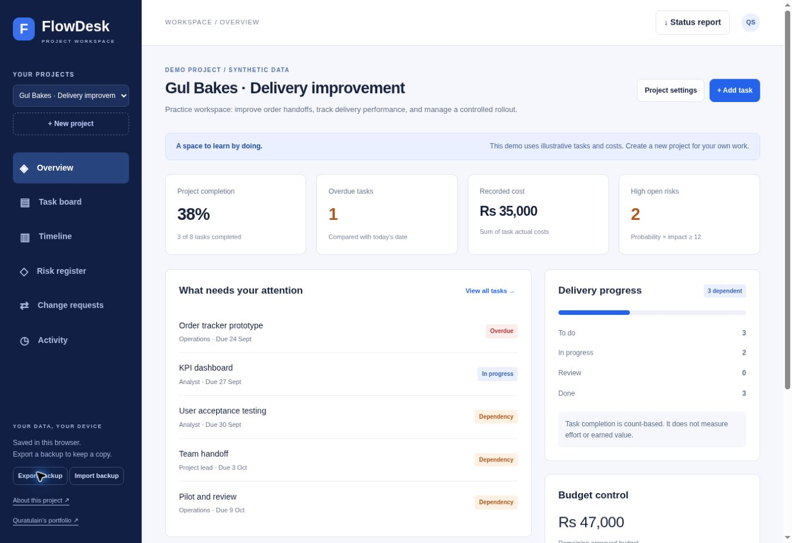

# Verification — 25 September 2026

- Nine Node domain tests passed: metrics, approval amounts, dependency constraints, cycle rejection, date/cost validation and backup validation/round-trip.
- Live GitHub Pages UI checked: project creation, task creation and completion, approved budget adjustment, and persistence after page reload.
- Verified example: original budget 5,000 PKR + approved change 1,000 − recorded cost 500 = remaining 5,500. One completed task displayed 100% completion.
- GitHub Pages deployment succeeded.
- Browser download-event automation timed out; backup/report file downloads and end-to-end import were not independently confirmed in that browser. JSON serialization and backup validation were covered by domain tests.
- Mobile styling is implemented; a physical mobile-device check has not been completed.

Screenshot contains synthetic demonstration data only.
